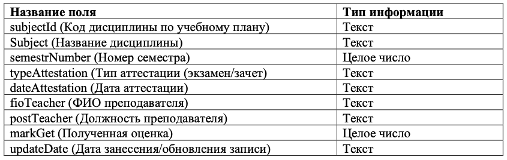

## Предназначение проекта
Работа выполнена с целью изучения SQLite и языка Python, а также получения опыта в разработке пользовательских приложений. В данном проекте реализованы функции для работы пользавтеля с таблицей "reportMPEI", в которой хранится информация студентах и промежуточных их аттестациях. 
## Описание работы и функций 
### 1. Начало работы
В функции “main” происходит проверка наличия необходимого файл с БД (в проекте используется "db_step3.sqlite") в рабочей директории пользователя. В случае отсутствия файла пользователю предлагается сменить директорию и запустить программу заново, если же файл найден, работа программы продолжается, выполняется подключение к БД, вызывается функция “start”.
Функция “start” отображает все поля таблицы и выводит пользовательское меню, в котором описываются доступные действия для работы с БД.После того, как пользователь выбрал действие, вызывается соответствующая функция.
### 2. Отображение содержимого таблицы
Для отображения текущего содержимого таблицы “reportMPEI” БД на экране, пользователь должен ввести цифру “1”. После этого вызывается функция “view_all_current_table”.Данная функция выполняет запрос в базу данных, возвращает содержимое. Затем, используя модуль “tabulate”, извлеченные данные выводятся на экран в виде таблицы, функция завершается, выводится начальное меню.
### 3. Сохранение таблицы БД в текстовый файл
Чтобы сохранить текущее содержимое таблицы БД в текстовый файл с задаваемым именем, используется функция – “save_all_database_in_file”. Пользователю необходимо ввести цифру “2”, после этого вводится имя сохраняемого файла. Файл сохранится в директории, где находится БД.В первой строке файл будет содержать имена столбцов, далее находитсясписок кортежей, в которых записаны строки данных из таблицы.
### 4. Отображение содержимого таблицы по логическому условию, которое задается пользователем 
При выборе пользователем цифры “3”, вызывается функция “field_choice”. Затем пользователю необходимо ввести имя одного из полей БД и задать условие по значениям этого поля (логическое выражение).Работа с пользовательским вводом предоставляет потенциальную угрозу безопасности БД, чтобы избежать вредоносных запросов (SQL -инъекций), добавлена проверка на корректное названия поля таблицы, а также предоставляю пользователю выбор возможных операторов. После совершения запроса в базу данных, на экране отображается
полученное подмножество строк в виде таблицы 
### 5. Удаление строки по условию
Функция “delete_row” отвечает за удаление строки из БД, она вызывается, если пользователь выбрал цифру “4”. Также у пользователя запрашивается код дисциплины и дата аттестации, строка с введенными параметрами будет удалена. Перед выполнением SQL-скрипта удаления строки, запрашивается подтверждение пользователя.
### 6. Изменение строк в таблице
При выборе пользователем цифры “5” вызывается функция “update_rows”, которая обновляет все строки таблицы “reportMPEI” в указанном поле. Перед выполнение SQL- скрипта проверяется корректный ввод имени поля.
### 7. Функция добавления новой строки в БД
Добавление новой строки с заданными значениями полей в таблицу “reportMPEI”, осуществляется с помощью функции “add_new_row”. Для ее вызова пользователю необходимо выбрать цифру “6”. Затем последовательно запрашиваются значения для полей, которые будут вставлены в таблицу.
### 8. Завершение работы
После того, как пользователь выполнит необходимые действия с таблицей “reportMPEI”, можно завершить работу с программой, выбрав цифру “8” из меню. Соединение с базой данных и переменная-курсор будут закрыты, программа завершится.

## Структура таблицы
Поля входящие в состав таблицы "reportMPEI"
 

- Создание таблицы с представленной структурой 
```py
import sqlite3
con = sqlite3.connect('NAME_DB.sqlite')
cur = con.cursor()
sql="""CREATE TABLE NAME_TABLE (subjectId TEXT,subject TEXT, semestrNumber INTEGER, typeAttestation TEXT, dateAttestation TEXT
fioTeacher TEXT, postTeacher TEXT,markGet INTEGER, updateDate TEXT);"""
cur.executescript(sql)
cur.close()
con.close()
```
